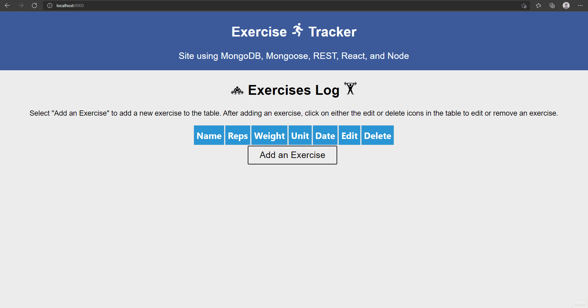

# Exercise Tracker

## General Info
This is a simple CRUD REST API web application developed with MongoDB & Mongoose, Express.js, React.js, and Node.js. The application was developed in a model-view-controller web framework.

## Website View

## Technologies
This project is created with:
* MongoDB & Mongoose
* Express.js
* React.js
* Node.js
* HTML/CSS
* JavaScript
